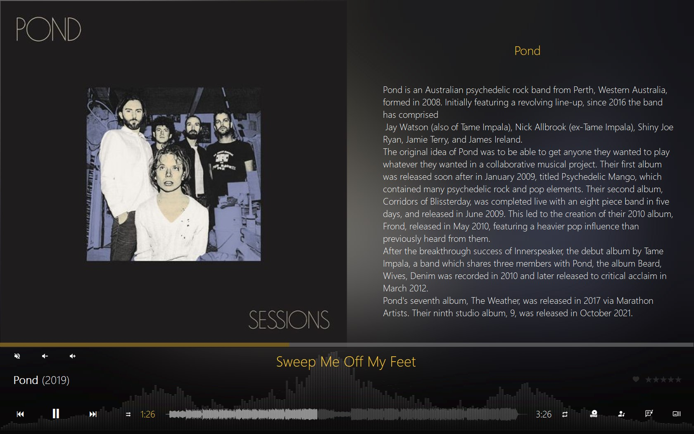

 

<h3 align="center">KazaT</h3>

MusicBee TheaterMode template 

<!-- TABLE OF CONTENTS -->

## Description

Template for **MusicBee** TheaterMode based on Fusion, CoverList, RdioStyle and others.

## Screenshots

|  |  |
|-------------------------------------------------------------------|---------------------------------------------------------|
| Upcomming tracks.                                                 | Lyrics.                                                 |

|  |  |
|-------------------------------------------------------------------|------------------------------------------------------------------|
| Artist biography.                                                 | Artist pictures.                                                 |

|   | 
|-----------------------------------------------------------------|
| Track details.                                                  |

## Project

Project: [https://github.com/AgustinGomila/kazatTheaterMode](https://github.com/AgustinGomila/warehouse_counter_android)