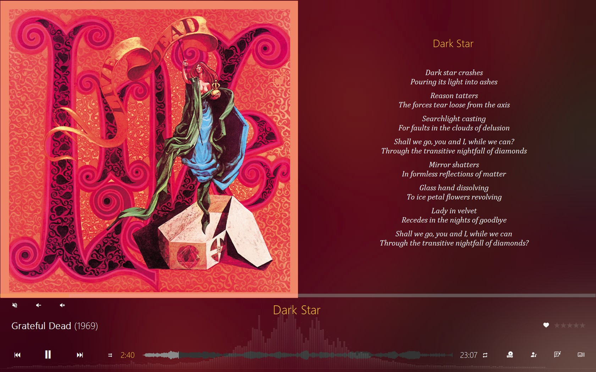
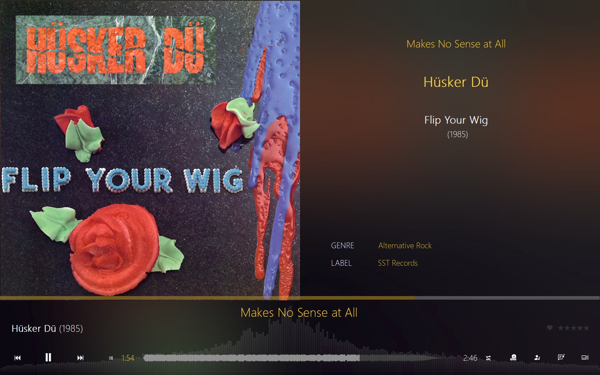

 

<h3 align="center">KazaT</h3>

MusicBee TheaterMode Template 

<!-- TABLE OF CONTENTS -->

## Table of contents

* [Description](#description)
* [Installation](#installation)
* [Screenshots](#screenshots)
* [Project](#project)

## Description

**KazaT** is a template for **MusicBee** TheaterMode Plugin based on *Fusion*, *CoverList*, *RdioStyle* and others.

**KazaT** template uses the *"OriginalYear"* tag to display the date of the albums. If you prefer to use the *"Year"*
tag you should
replace all references in the *KazaT.xml* file.

## Installation

Download the file **[KazaT.zip](KazaT.zip)** and unzip its contents in the folder
*C:\Program Files (x86)\MusicBee\Plugins\TheaterMode.List*

## Screenshots

|  |  |
|------------------------------------------------------------------|---------------------------------------------------------|
| Upcoming tracks.                                                 | Lyrics.                                                 |

|  |  |
|-------------------------------------------------------------------|------------------------------------------------------------------|
| Artist biography.                                                 | Artist pictures.                                                 |

|  | 
|----------------------------------------------------------------|
| Track details.                                                 |

## Project

Project: [https://github.com/AgustinGomila/kazatTheaterMode](https://github.com/AgustinGomila/warehouse_counter_android)